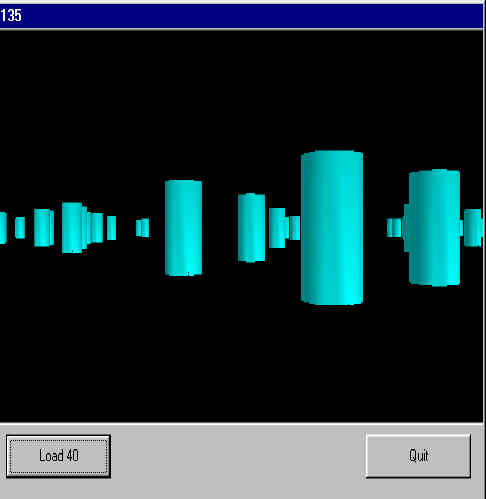



## Direct X tank version 0\.2

### Description

I am now turning my tank game into DirectX tank. And here it is so far. This is about 5 hours solid work spread over a week. Now I know somthing about Direct X, I should soon have moving objects to shoot at. But for now, you just drive around a load of shapes. Its pretty fast thought, over 100,000 polygons per sec on a (cwappy) cerlon 200, without any hardware support what so ever. As its direct X, I asume that it will run throught harware if you have it. Any way, say what you think, and stand around for the full version. +, if you know any FREE software for creating 3D models, then please tell me, cos notepad is getting annoying.

To play, click on Add 40, and sellect a model, with the extension RAW (5 provided). Now move your mouse around the game window to move around, like in the original tank game. Click on add 40 again, to add more shapes. By the way, I used some code by 'Tim Talma' to figure out DirectX. However, in his code, he says its 30% Microsoft SDK egg and engine parts, but I think I cut out all Tims code, so I have all Microsoft to thank
 
### More Info
 
None, really, except selecting what shapes appear

...and I can't even see these messages appear on any part of thewebsite, so whats the point?

Do I really have to fill this in?

No-one reads them anyway...

             |
---                |---
**Submitted On**   |2000-07-21 19:45:16
**By**             |[N/A](https://github.com/Planet-Source-Code/PSCIndex/blob/master/ByAuthor/empty.md)
**Level**          |Intermediate
**User Rating**    |4.0 (12 globes from 3 users)
**Compatibility**  |VB 6\.0
**Category**       |[Games](https://github.com/Planet-Source-Code/PSCIndex/blob/master/ByCategory/games__1-38.md)
**World**          |[Visual Basic](https://github.com/Planet-Source-Code/PSCIndex/blob/master/ByWorld/visual-basic.md)
**Archive File**   |[CODE\_UPLOAD80057212000\.zip](https://github.com/Planet-Source-Code/direct-x-tank-version-0-2__1-9947/archive/master.zip)

